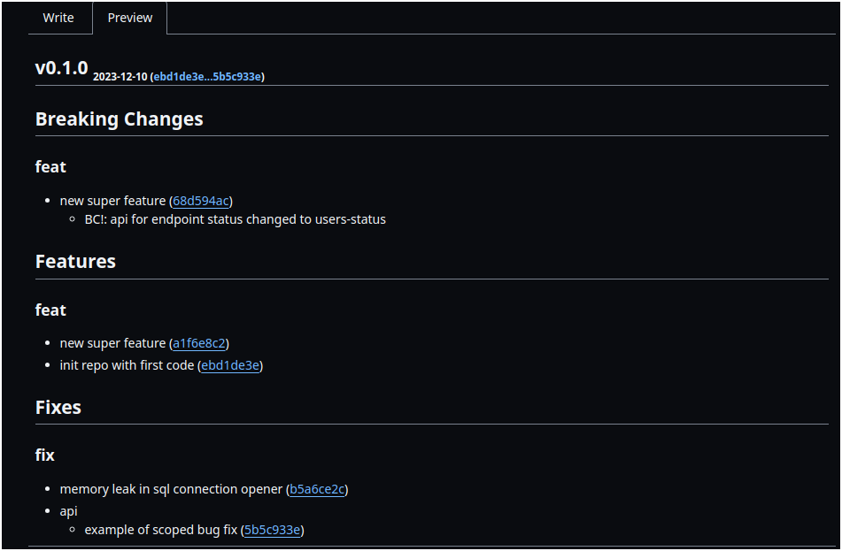

# Autogit

  

**Communicating through git professionally**

autogit is a CLI tool to validate submitted commits according to [git conventional commits](https://www.conventionalcommits.org/en/v1.0.0/) standard. the tool allows to generate changelogs for releases in different formats. the ability to see quickly how your changelog looks motivates you to write more meaningful commits.

as a result of the tool work, you have decreased toll on release documentation writing, you communicate developer work better to other developers/users, and have a more professional-looking repository in terms of commits, tags, versions, releases, and changelogs.

# Features

- hooks to git-hooks and works to validate your git commits to [git conventional commits]((https://www.conventionalcommits.org/en/v1.0.0/)) standard for any git tool.
  - has extra possible validating rules to configure, like having a minimum of 3 words in a subject of commit.
  - `autogit hook activate --global`(flag to turn it on for all repos)
- suggests next [semantic version](https://semver.org/) for your product release with `autogit semver`
  - has options to suggest the next version as alpha, beta, or pre-release version with build metadata.
- generates changelogs with `autogit changelog` command
  - currently supports markdown and bbcode formats
  - has option `--validate` to run validation of commits (for CI usage)
- easy create and push of a git tag with auto-inserted changelog through `autogit semver --tag --push`
- initialize settings for more customization with `autogit init` inside a git repo
  - uncomment and override desired settings
- find out more commands and options with `autogit [any set of sub commands] --help`
- CI-friendly binary file, which not require any dependencies for its usage for everything
  - see [CI example](.github/workflows/validate.yml)
  - compiled for linux/windows/macos and amd64/arm64/386/arm
  - Contains inbuilt git. Not requiring git to be installed for its functionality

# Getting started

## text version at ubuntu 22.04:
- [install latest](#install-latest)
- install git if not present with `apt install -y git`
- init git repo if not present `git init && git config user.email "you@example.com" && git config user.name example`
- activating git hook, `autogit hook activate --global` (optionally global for all repos)
- write some commits:
  - `echo 123 >> README.md && git add -A && git commit -m "feat: init repo with first code"`
  - `echo 123 >> README.md && git add -A && git commit -m "fix: memory leak in sql connection opener"`
  - `echo 123 >> README.md && git add -A && git commit -m "feat: new super feature"`
  - `echo 123 >> README.md && git add -A && git commit -m 'feat!: new super feature'`

`BREAKING CHANGE: api for endpoint status changed to users-status'`
    - due to bash using `!` as a keyword syntax, we need to use `''` single quotes
  - `echo 123 >> README.md && git add -A && git commit -m "fix(api): example of scoped bug fix"`
  - generate changelog with `autogit changelog`

## video version:

https://github.com/darklab8/darklab_autogit/assets/20555918/44a05f9b-393f-4f6c-aea5-f4732f4fde73

# Installation

## Linux

### Install latest

- install curl if not installed.(`apt update && apt install -y curl` for debian/ubuntu)
- install git if not present (`apt update && apt install -y git` for debian/ubuntu)
- install autogit with `rm $(which autogit) ; curl -L $(curl -Ls -o /dev/null -w %{url_effective} https://github.com/darklab8/darklab_autogit/releases/latest | sed "s/releases\/tag/releases\/download/")/autogit-linux-amd64 -o /usr/local/bin/autogit && chmod 777 /usr/local/bin/autogit`
- check installation with `autogit version` command. Expect to see `OK autogit version: v{version}`

### install specific version

- install with `rm $(which autogit) ; curl -L https://github.com/darklab8/darklab_autogit/releases/download/v{VERSION}/autogit-linux-amd64 -o /usr/local/bin/autogit && chmod 777 /usr/local/bin/autogit`

## Windows

- install [Git Bash](https://git-scm.com/downloads)
- install lautogit `mkdir -p ~/bin ; rm $(which autogit) ; curl -L $(curl -Ls -o /dev/null -w %{url_effective} https://github.com/darklab8/darklab_autogit/releases/latest | sed "s/releases\/tag/releases\/download/")/autogit-windows-amd64.exe -o ~/bin/autogit.exe && chmod 777 ~/bin/autogit.exe`
- check installation with `autogit version` command. Expect to see `OK autogit version: v{version}`

## Code architecture

### Architecture goals

- Unit testable first, everything else later.
- Justified abstractions will appear with a strict minimal interface to reduce the overall complexity of a code.
- High usage of `type NewType string` for more self-documentation
- Trying to find the domain language of the tool
- Minimize third-party lib dependencies
- Simplify end-user installation
- No auto-updates inside the program. Everything should work offline.
- CI-friendly, zero system dependencies solution
- Unit testing for Linux, checking for Windows, and compiling for macOS.

# Other docs

- [Article](docs/git-conventional-commits.md)
- [Algorithms](docs/development/algos.md)
- [Dev setup](docs/development/dev_setup.md)
- [Future plans](docs/development/plans.md)

# Contacts

- [@dd84ai](https://github.com/dd84ai) at `dark.dreamflyer@gmail.com`
- open [Pull Requests with question](https://github.com/darklab8/darklab_autogit/issues)
- [Darklab Discord server](https://discord.gg/aukHmTK82J)
