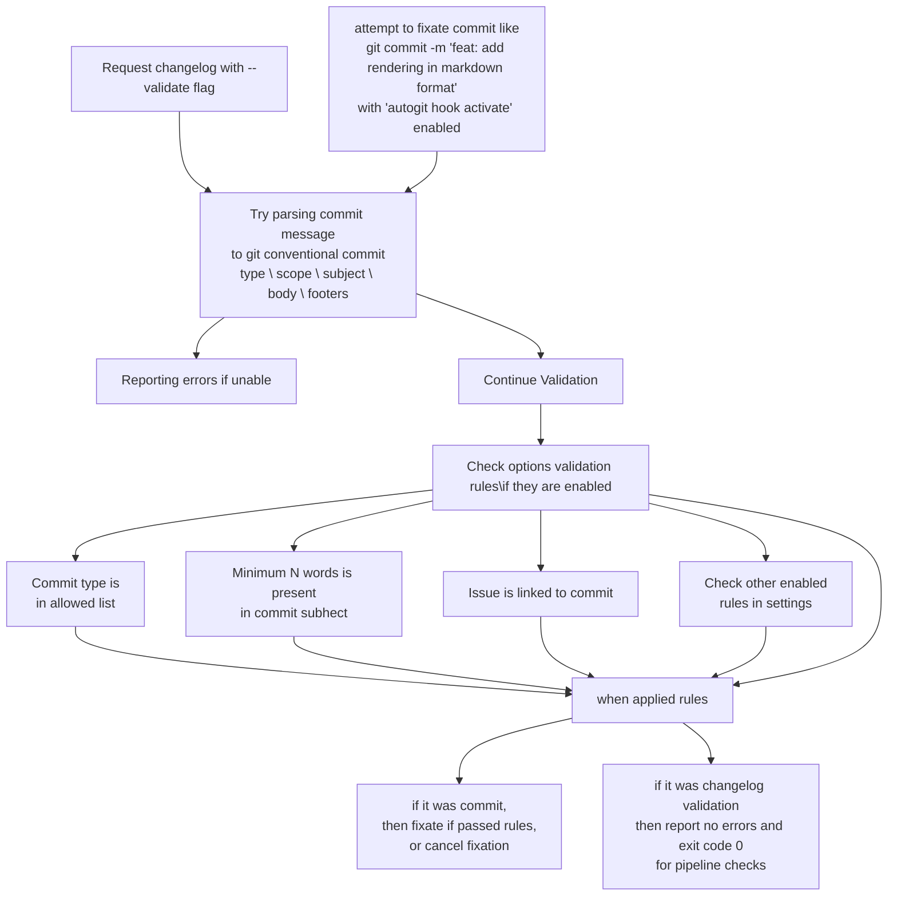
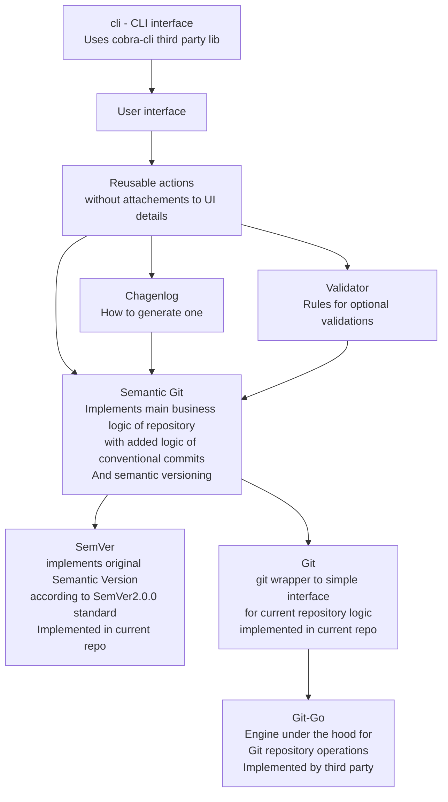

  

## Description

CI friendly tool for automatic following of Git Conventional commit rules (standard for more descriptive commits)

The tool generates automatically changelogs of new features and bug fixes for your product releases

and also calculates next semantic version your next product release should be having

Essentially tool... To decrease toll on release documentation writing, and to start writing more descriptive commits

See what are git conventional commits: https://www.conventionalcommits.org/en/v1.0.0/

See what is semantic versioning: https://semver.org/

## Features

- [git conventional commits](https://www.conventionalcommits.org/en/v1.0.0/) validations (and optional other ones) on pre-commit hook
- validation of your commit history on `autogit changelog --validate` request
- automatic next [semantic versioning](https://semver.org/spec/v2.0.0.html) calculation for your product release
- auto generating [changelogs](https://github.com/darklab8/darklab_autogit/releases/tag/v0.3.0-rc.2) new features and bug fixes to your next product release
- when you create tag with `autogit version --tag --other-flags`, changelog is automatically added to annotated git tag
- CI friendly binary file for any OS and arhictecture. Development with CI in mind. [CI examples](https://github.com/darklab8/darklab_autogit/tree/master/.github/workflows)
- Contains inbuilt git. Not requiring git to be installed for its functionality

## Compiled for:

- linux-amd64
- linux-arm64
- linux-386
- linux-arm
- windows-amd64
- windows-386.exe
- windows-arm64.exe
- windows-arm.exe
- macos-amd64
- macos-arm64

## Support:

##### First tier support - issues can solved on our own

- for linux and CI usage

##### Second tier support - issues may be solved on our own

- for windows

##### Third tier support - only compiled, and accepting bug fixes implemented by contributors

- for macos

## Installation

1. [download latest stable release](https://github.com/darklab8/darklab_autogit/releases) and put to env PATH searchable range

- Linux:

  - Check your PATH bin serachable locations with `echo "$PATH"` and put into any of them or add new location, change settings to allow it being executable with `chmod`
  - Recomendation to put into `/usr/local/bin`
  - Linux ubuntu one liner: `curl -o /usr/local/bin/autogit https://github.com/darklab8/darklab_autogit/releases/download/v1.0.0/autogit-linux-amd64 && chmod 777 /usr/local/bin/autogit`
- Windows:

  - Check your PATH bin locations with `echo %PATH%` and put binary file any of them or add to new one, be sure to rename from like `autogit-windows-amd64.exe` to `autogit.exe`
  - If u use `Git Bash`, recommendation to put into `~/bin` for usage in Git Bash only, or into `C:\Program Files\Git\cmd` for working in any terminal
  - U can add to any other PATH bin searchable locations or add a new one
- MacOS

  - (To be written where to put)

2. copy [autogit.yml](https://github.com/darklab8/darklab_autogit/releases/download/v1.0.0/autogit.yml) from same binary release you downloaded executable! And put to root of your git project folder and adjust settings to your repository specifics
3. run `autogit hook activate` to create `.git-hook` folder and enabling it in your git repository settings

P.S. Current repository runs on configured autogit as well

## Usages

### scenario #1 - validator / Git commit validation / Changelog validation

You try to write git commit -m "feat: add rendering in format format"
your githook is activated and tries to parse your commit name accroding to git conventional commits standard. If unable, it will give you error and prevent commit

### scenario #2 - changelog / Your wish to see changelog of additions you made, what are new features, what are fixes. For user view

You wish to have changelog auto generated.

###### example of rendered changelog

[Full example of rendered changelog](https://github.com/darklab8/darklab_autogit/releases/tag/v0.3.0-rc.2)

### Scenario #3 - nextSemVer / You wish to know which next semantic version / semantic tag should be applied to your release.

Program checks if u made no commits, or only refactoring and styling.

- If u made no changes, then next version is same as previous one.
- If you made `fix`, then it increases PATCH version of semantic version. Your next version is `0.0.2` rendered
- if you made `feat` request, then next MINOR version is increased. Your next version is `0.1.0`
- if you made breaking changes, users should know `feat!` or `BREAKING CHANGE:`, then next version is `1.0.0`
- if u had no previous versions, it will calculate new one as `0.0.0` + calculated version changes

more detailed algorithm, accounting also prerelease version calculations:

### TLDR

So in a nutshell, it takes away complexity of using git conventional commits and semantic versioning. You are auto guided and auto corrected how correctly to perform it xD
u only need correctly writing meaning/subject/description to your commits 🙂 but since u see what is rendered to users, you quickly learn how to write it better
Plus it was made in CI friendly way

why semantic versioning is important, to read here https://semver.org/
well, about git conventional commits is here: https://www.conventionalcommits.org/en/v1.0.0/

as an example, all my releases of darktool were made with similar automatation.
Changelogs and versions https://github.com/darklab8/darklab_freelancer_darktool/releases

## Future development and resources for inspiration

- https://www.quora.com/What-is-the-difference-between-alpha-beta-and-RC-software-version // Adding ability of beta versions
- https://github.com/conventional-changelog/commitlint/tree/master/%40commitlint/config-conventional // Configurable stricter rules to validator
- https://github.com/angular/angular/blob/22b96b9/CONTRIBUTING.md#-commit-message-guidelines // Just more about git conventional commits
- https://www.npmjs.com/package/git-conventional-commits
- https://www.conventionalcommits.org/en/about/ tools
- https://github.com/c4urself/bump2version/blob/master/RELATED.md // research alternatives
- https://gist.github.com/qoomon/5dfcdf8eec66a051ecd85625518cfd13

Discussions about future development and features in [Pull Requests](https://github.com/darklab8/darklab_autogit/issues)

## Dev Requirements

- cobra generator https://github.com/spf13/cobra-cli/blob/main/README.md
- cobra guide https://github.com/spf13/cobra/blob/main/user_guide.md
- godoc
- add binary discovery for cobra-cli, godoc detection
  - `export PATH="$PATH:/usr/local/go/bin:$HOME/go/bin"`
- install latest stable autogit 😄

## Code architecture

## Contributions and contacts:

- contact author [@dd84ai](https://github.com/dd84ai) at `dark.dreamflyer@gmail.com`
- open [Pull Requests with bug fix or feat requests](https://github.com/darklab8/darklab_autogit/issues)
- join [Darklab Discord server](https://discord.gg/aukHmTK82J)
