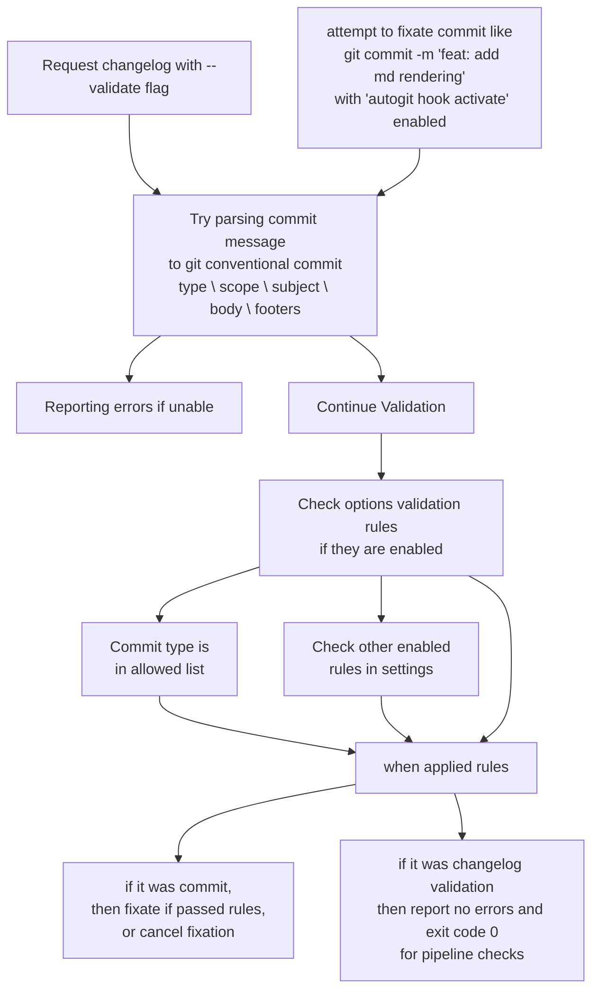
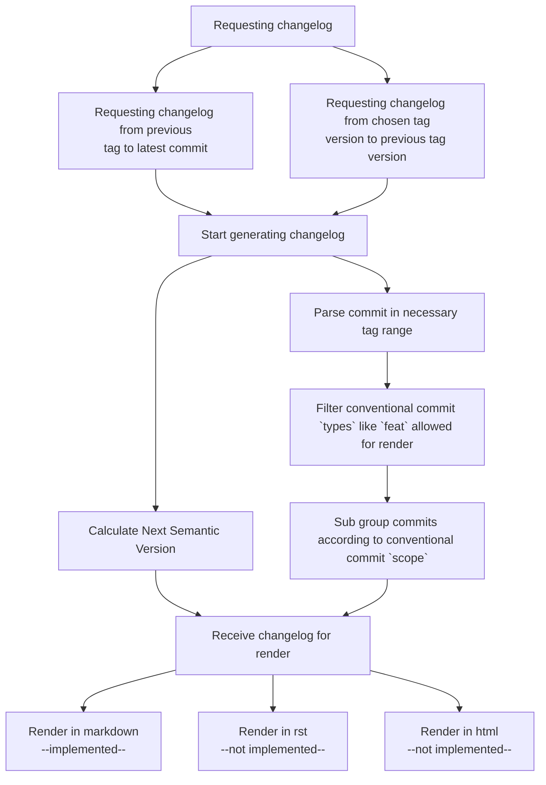
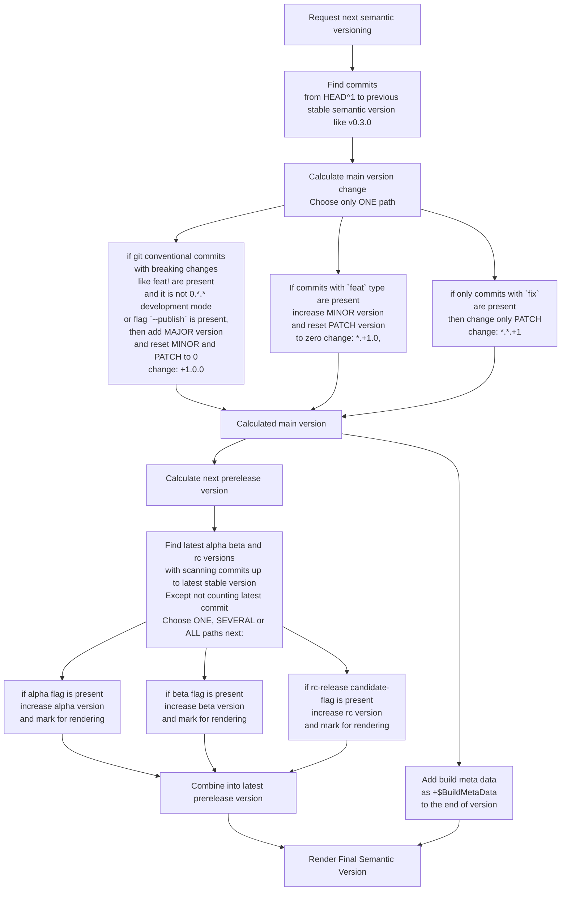

# Algorithms

## scenario #1 - validator / Git commit validation / Changelog validation

You try to write git commit -m "feat: add rendering in format format"
your githook is activated and tries to parse your commit name accroding to git conventional commits standard. If unable, it will give you error and prevent commit

## scenario #2 - changelog / Your wish to see changelog of additions you made, what are new features, what are fixes. For user view

You wish to have changelog auto generated.

### example of rendered changelog

[Full example of rendered changelog](https://github.com/darklab8/darklab_autogit/releases/tag/v0.3.0-rc.2)

## Scenario #3 - nextSemVer / You wish to know which next semantic version / semantic tag should be applied to your release.

Program checks if u made no commits, or only refactoring and styling.

- If u made no changes, then next version is same as previous one.
- If you made `fix`, then it increases PATCH version of semantic version. Your next version is `0.0.2` rendered
- if you made `feat` request, then next MINOR version is increased. Your next version is `0.1.0`
- if you made breaking changes, users should know `feat!` or `BREAKING CHANGE:`, then next version is `1.0.0`
- if u had no previous versions, it will calculate new one as `0.0.0` + calculated version changes

more detailed algorithm, accounting also prerelease version calculations:

