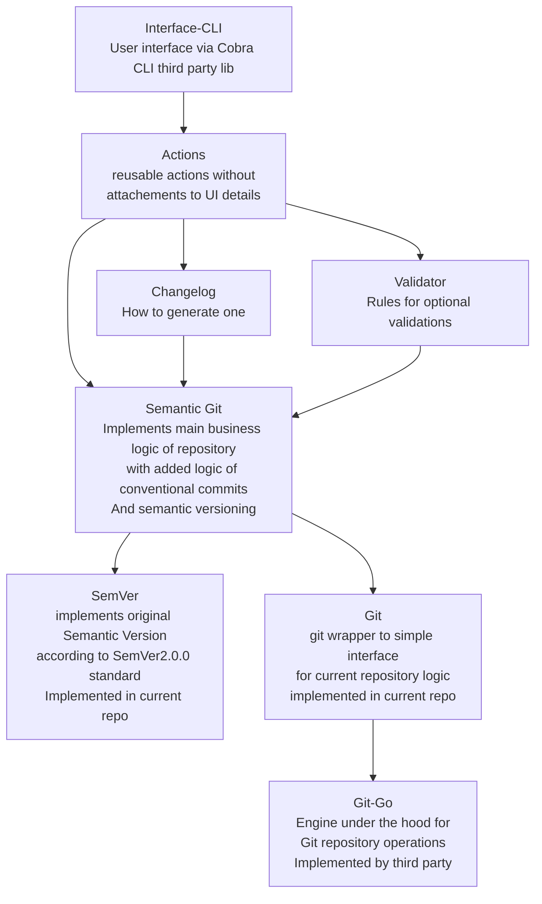

# Code architecture

## Goals

- Unit testable first. everything else later.
- Abstractions will appear with a strict minimal interface to reduce overall complexity of a code.
- High usage of `type NewType string` for more self documentation
- Minimize third party lib dependencies
- Simplify end user installation
- No autoupdates. Everything should work offline.
- CI friendly, zero system dependencies solution

## Diagram

## Support promises:

### First tier support

- for linux and CI usage
    - we will prioritize solving any issues.
    - Unit tests run on every commit.

### Second tier support

- for windows
    - periodically checking it works in VM with Windows 10

### Third tier support

- for macos
    - only compiled

